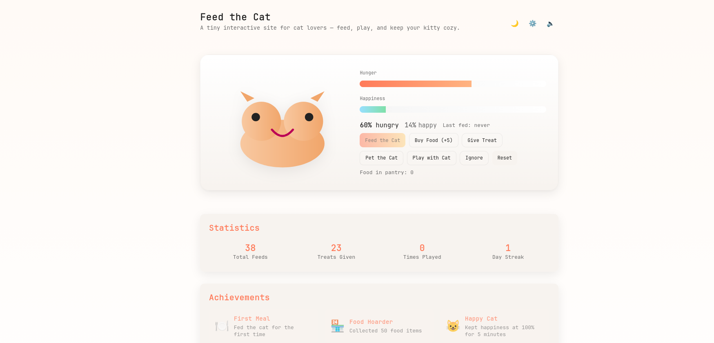
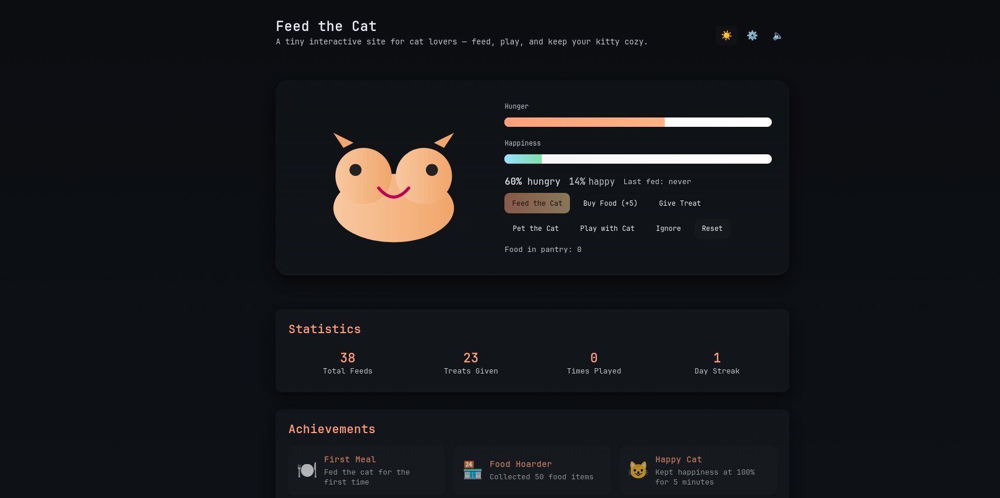

# 🐱 Feed the Cat

A delightful interactive web game where you take care of a virtual cat. Keep your kitty happy and well-fed through various interactions and unlock achievements along the way!

<div align="center">
  
  <p><em>✨ Feed the Cat - Light Mode ✨</em></p>
  
  
  <p><em>🌙 Feed the Cat - Dark Mode 🌙</em></p>

  [](https://github.com/AddieDie/feedthecat)
  [](https://github.com/AddieDie/feedthecat)
  [](https://github.com/AddieDie/feedthecat)
  [](https://github.com/AddieDie/feedthecat/blob/main/LICENSE)
</div>

## ✨ Overview

Features

- Feed, Buy, Pet, Play, Give Treat and Ignore actions.
- Hunger and Happiness meters with smooth animations.
- Dark mode with theme persistence.
- Settings panel to tweak hunger tick speed, feed amount, and treat potency.
- State saved to localStorage so your cat persists between visits.

Quick start

1. Clone or download this repository.
2. Open `index.html` in your browser for a quick preview.

Recommended local preview (Node.js)

```powershell
# from project root
npx serve . -l 3000
# then open http://localhost:3000
```

Or use VS Code Live Server extension.

How to use

- Buy Food to add items to the pantry. Feed consumes food and reduces hunger.
- Pet and Play increase happiness; playing raises hunger slightly.
- Give Treat consumes food but gives a larger happiness boost.
- Ignore lowers happiness and mildly increases hunger (simulates neglect).
- Use the ⚙️ settings button in the header to change tick speed, feed amount and treat potency. Save to persist.

Development notes

- Files:
  - `index.html` — markup and UI
  - `src/css/style.css` — styles and themes
  - `src/js/app.js` — game logic and persistence
- The app uses vanilla JS and CSS (no build step). Modify and open `index.html` to test.
- Settings and state are stored in localStorage under keys `feed-the-cat:v1` and `feed-the-cat:settings`.

Extending the project

- Add more actions (sleep, groom), achievements, or animations.
- Add audio feedback when feeding or playing.
- Add unit tests for the state logic.

## 🎮 Play Now

1. Clone this repository:
   ```bash
   git clone https://github.com/AddieDie/feedthecat.git
   ```
2. Open `index.html` in your browser, or serve it using a local server:
   ```bash
   # Using Python
   python -m http.server 8000
   
   # Using Node.js
   npx serve
   ```

## ✨ Features

### Core Gameplay
- 🍽️ Feed your cat and manage hunger levels
- 😊 Keep your cat happy through various interactions
- 🎯 Balance hunger and happiness meters
- 💝 Multiple ways to interact: feed, play, pet, treat
- 🔄 Persistent state saves between visits

### Interactive Elements
- 🎮 Keyboard shortcuts for quick actions:
  - `F` - Feed the cat
  - `B` - Buy food
  - `T` - Give treat
  - `P` - Play with cat
  - `H` - Pet the cat
  - `I` - Ignore (if you dare!)

### Visual and Audio
- 🎨 Beautiful animations and transitions
- 🌓 Dark/light theme support
- 🔊 Sound effects for all interactions
- 💫 Smooth progress bar animations
- 😺 Playful cat expressions

### Achievement System
- 🏆 8 unique achievements to unlock:
  - First Meal
  - Food Hoarder (50 food items)
  - Happy Cat (100% happiness for 5 minutes)
  - Treat Master (20 treats)
  - Play Time (10 plays)
  - Night Owl (play at midnight)
  - Dedicated Owner (5-day streak)
  - Perfect Care (80%+ stats for 10 minutes)

### Statistics Tracking
- 📊 Track your progress with detailed stats
- 📈 Daily visit streaks
- 🎯 Achievement progress
- 📅 Persistent records

## 🛠️ Technical Details

### File Structure
```
feedthecat/
├── index.html          # Main game interface
├── src/
│   ├── css/
│   │   └── style.css   # Styles and animations
│   ├── js/
│   │   ├── app.js      # Core game logic
│   │   └── achievements.js # Achievement system
│   └── audio/          # Sound effects
└── README.md
```

### Technologies Used
- 💻 Pure HTML5, CSS3, and JavaScript
- 🎨 CSS Custom Properties for theming
- 💾 localStorage for game state persistence
- 🔊 Web Audio API for sound effects
- 📱 Responsive design for all devices

## ⚙️ Configuration

### Game Settings
Access the settings panel (⚙️) to customize:
- Hunger tick speed (seconds)
- Feed amount per action
- Treat potency
- Sound effects toggle

### Theme
- Toggle between light/dark theme using the theme button (🌙/☀️)
- Theme preference is saved automatically

## 🎯 Getting Started

1. **First Steps**
   - Buy food using the "Buy Food" button
   - Feed your cat when hungry
   - Pet and play to increase happiness

2. **Advanced Care**
   - Balance hunger and happiness levels
   - Use treats strategically for happiness boosts
   - Maintain a daily visit streak
   - Work towards achievements

3. **Tips for Success**
   - Keep food stocked up
   - Don't let hunger get too high
   - Mix different interactions
   - Visit daily for streaks
   - Use keyboard shortcuts for quick actions

## 📄 License

This project is licensed under the MIT License - see the [LICENSE](LICENSE) file for details.


## 🔄 Updates

Latest updates:
- Achievement system
- Sound effects
- Keyboard shortcuts
- Improved animations
- Statistics tracking
- Mobile responsiveness improvements


