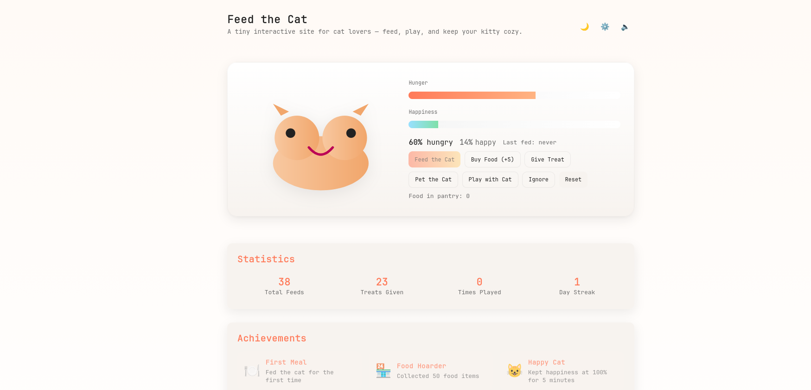
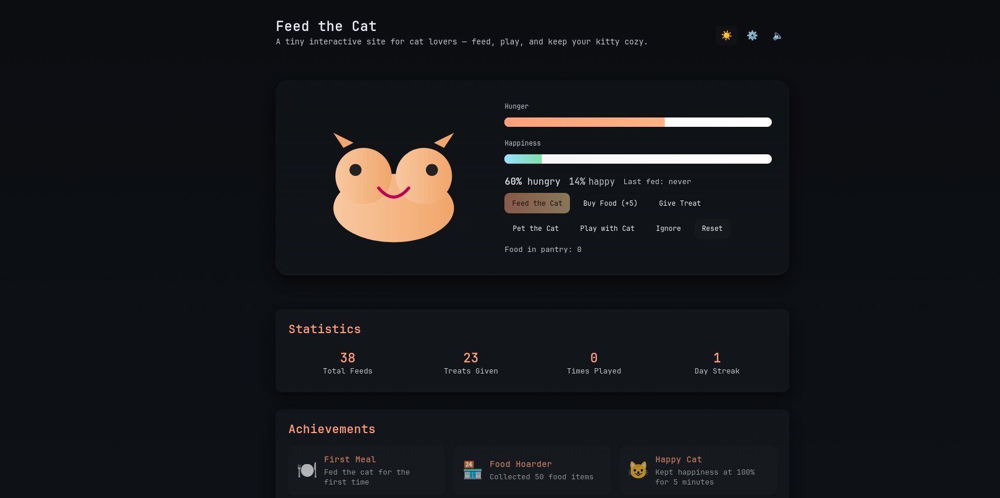

# 🐱 Feed the Cat

A delightful interactive web game where you take care of a virtual cat. Keep your kitty happy and well-fed through various interactions and unlock achievements along the way!

<div align="center">
  
  <p><em>✨ Feed the Cat - Light Mode ✨</em></p>
  
  
  <p><em>🌙 Feed the Cat - Dark Mode 🌙</em></p>

  [](https://github.com/AddieDie/feedthecat)
  [](https://github.com/AddieDie/feedthecat)
  [](https://github.com/AddieDie/feedthecat)
  [](https://github.com/AddieDie/feedthecat/blob/main/LICENSE)
</div>

## ✨ Overview

Features

- Feed, Buy, Pet, Play, Give Treat and Ignore actions.
- Hunger and Happiness meters with smooth animations.
- Dark mode with theme persistence.
- Settings panel to tweak hunger tick speed, feed amount, and treat potency.
- State saved to localStorage so your cat persists between visits.

Quick start

1. Clone or download this repository.
2. Open `index.html` in your browser for a quick preview.

Recommended local preview (Node.js)

```powershell
# from project root
npx serve . -l 3000
# then open http://localhost:3000
```

Or use VS Code Live Server extension.

How to use

- Buy Food to add items to the pantry. Feed consumes food and reduces hunger.
- Pet and Play increase happiness; playing raises hunger slightly.
- Give Treat consumes food but gives a larger happiness boost.
- Ignore lowers happiness and mildly increases hunger (simulates neglect).
- Use the ⚙️ settings button in the header to change tick speed, feed amount and treat potency. Save to persist.

Development notes

- Files:
  - `index.html` — markup and UI
  - `src/css/style.css` — styles and themes
  - `src/js/app.js` — game logic and persistence
- The app uses vanilla JS and CSS (no build step). Modify and open `index.html` to test.
- Settings and state are stored in localStorage under keys `feed-the-cat:v1` and `feed-the-cat:settings`.

Extending the project

- Add more actions (sleep, groom), achievements, or animations.
- Add audio feedback when feeding or playing.
- Add unit tests for the state logic.

License

This project is provided under the MIT License. See `LICENSE` for details.


